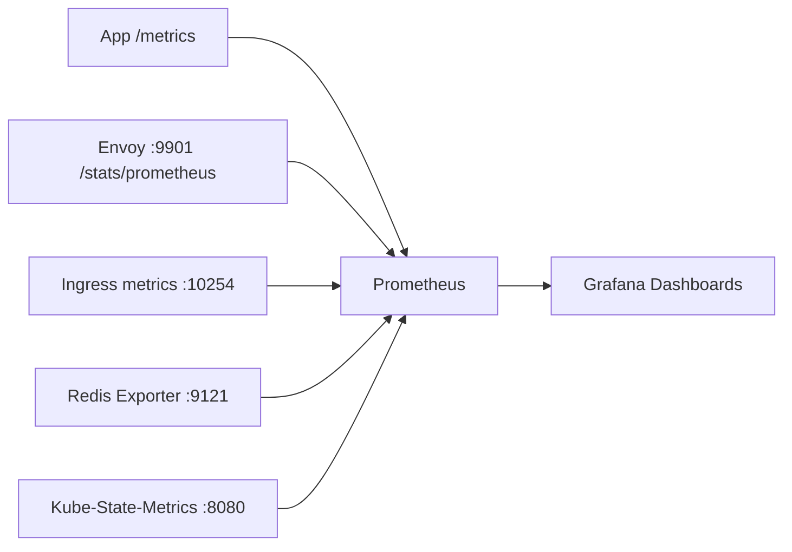
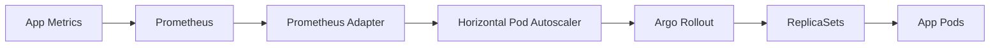
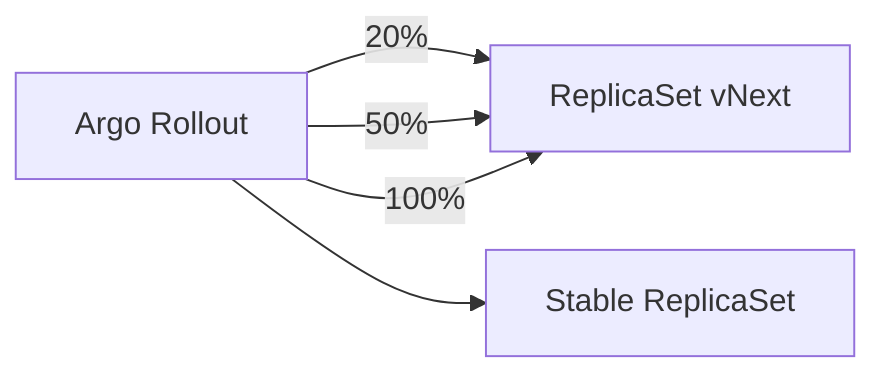

# Mood of the Day — Kubernetes Edition (Detailed)

This repository is the Kubernetes upgrade of the **Mood of the Day** app. It is intentionally built to showcase **why Kubernetes is worth the complexity** compared to a Docker‑only setup. The application is intentionally simple (Flask + Redis) so the focus stays on system‑design features and platform capabilities.

Docker‑only version:
- https://github.com/PranayChowdary48/mode-of-the-day-docker

---

## Table of contents
- [Project overview](#project-overview)
- [Setup & Deployment](#6-setup--deployment)
- [How to access](#how-to-access)
- [Architecture overview](#architecture-overview)
- [Dev vs Prod overlays](#dev-vs-prod-overlays)
- [Key capabilities](#key-capabilities)
- [Tech stack](#tech-stack)
- [Kubernetes networking and traffic flow](#kubernetes-networking-and-traffic-flow)
- [App behavior and caching (Redis)](#app-behavior-and-caching-redis)
- [Traffic control and resilience (Envoy)](#traffic-control-and-resilience-envoy)
- [Observability](#observability)
- [Healthchecks and self-healing](#healthchecks-and-self-healing)
- [Progressive delivery (Argo Rollouts)](#progressive-delivery-argo-rollouts)
- [Autoscaling (HPA)](#autoscaling-hpa)
- [Security controls](#security-controls)
- [Stateful data and replication (Redis)](#stateful-data-and-replication-redis)
- [Troubleshooting & Useful Commands](#troubleshooting--useful-commands)
- [Limitations and trade-offs](#limitations-and-trade-offs)
- [One-line takeaway](#one-line-takeaway)

---

## Project overview
This repo is the **Kubernetes chapter** in a DevOps learning series (Docker → Kubernetes → AWS → Automation). It demonstrates platform features that are hard to achieve in Docker Compose alone: health‑aware routing, progressive delivery, autoscaling, network isolation, and richer observability.

The app generates a daily mood + GIF, caches it in Redis with a TTL, and serves it through Kubernetes Ingress. Metrics are scraped by Prometheus and visualized in Grafana.

---

# Setup & Deployment

```sh
# 1) Build inside Minikube so the cluster can pull the image without a registry.
eval $(minikube docker-env)
docker build -t docker-app:latest app

# 2) Choose one deployment mode.
#    Dev = lightweight (no HPA, no NetworkPolicies, no Rollouts).
make deploy-dev
#    Prod = full platform (Rollouts + HPA + NetworkPolicies + higher replicas).
make deploy-prod

# 3) Start local ingress + host‑header proxy (also forwards Prometheus/Grafana).
make ingress-local
open http://localhost:8089/

# 4) Quick sanity checks (pods + ingress).
kubectl -n ingress-nginx get pods
kubectl -n mood get pods
kubectl -n mood get ingress

# 5) Trigger a rollout (prod only) by bumping the pod template annotation.
kubectl -n mood patch rollout app --type='merge' -p \
'{"spec":{"template":{"metadata":{"annotations":{"redeploy-timestamp":"'"$(date +%s)"'"}}}}}'
```

---

## How to access
- Application (via ingress-local): `http://localhost:8089/`
- Prometheus (auto port-forwarded by ingress-local): `http://localhost:9090/`
- Grafana (auto port-forwarded by ingress-local): `http://localhost:3000/`

---

## Architecture overview

### Request flow (runtime)
```mermaid
flowchart LR
  U[User/Browser] --> I[Ingress-NGINX]
  I --> S[Service: app]
  S --> E1[Envoy (pod 1)]
  S --> E2[Envoy (pod 2)]
  E1 --> A1[App (pod 1)]
  E2 --> A2[App (pod 2)]
  E1 --> R[Redis StatefulSet]
  E2 --> R
```

### Observability path


### Autoscaling control loop


### Progressive delivery (canary)


---

## Dev vs Prod overlays
This repo has two operational profiles with different trade‑offs:

| Capability | Dev overlay | Prod overlay |
| --- | --- | --- |
| App controller | Deployment | Argo Rollout |
| App replicas | 1 | 3 |
| NetworkPolicies | Removed | Enabled |
| HPA + Prometheus Adapter | Removed | Enabled |
| Prometheus/Grafana replicas | 1 | 2 |
| Namespace pod‑security labels | No | Yes |
| App resources | Lower | Higher |
| Ingress hosts | `mood.local` | `mood.local`, `mood.example.com` |

Use dev for fast local iteration, prod for full platform validation.

---

## Key capabilities
- Health‑aware routing (readiness/liveness/startup probes)
- Canary rollouts (Argo Rollouts)
- Autoscaling (CPU + custom metrics)
- Network isolation (NetworkPolicies)
- Envoy traffic control (rate limit + retries/backoff)
- Redis replication (master/replica)
- Full observability (Prometheus + Grafana + exporters)
- Hardened runtime (non‑root, seccomp, RBAC)

---

## Tech stack
| Component | Purpose |
| --- | --- |
| Python (Flask) | Application and APIs |
| Redis | Daily cache with TTL (master/replica) |
| Envoy | Sidecar proxy (rate limit, retries, CB) |
| Ingress‑NGINX | External routing + sticky sessions |
| Prometheus | Metrics scraping + storage |
| Grafana | Dashboards + SLO panel |
| Prometheus Adapter | Custom metrics API for HPA |
| Argo Rollouts | Canary delivery |
| kube-state-metrics | Cluster object metrics |

---

## Kubernetes networking and traffic flow
**What’s implemented**
- Ingress‑NGINX is the only public entry point with host‑based routing.
- Service traffic targets Envoy’s HTTP listener, so rate limits and retries apply to all requests.
- Sticky sessions are enforced with a short‑lived cookie for demo visibility.
- Default‑deny NetworkPolicies with explicit allow rules isolate pods by function.

**Functional tests**
```
make test-basic
make test-whoami
make test-sticky
```
**Expected:** HTTP 200, multiple pod hostnames, `Set-Cookie` with 10s TTL.


---

## App behavior and caching (Redis)
**What’s implemented**
- Daily cache key: `mood:<YYYY-MM-DD>`
- TTL expires at midnight (daily rollover)
- `/refresh` invalidates and regenerates today’s mood (basic‑auth protected)
- Redis cache is ephemeral and safe to rebuild

**Functional tests**
```
# Same timestamp (cache hit)
curl -s http://localhost:8089/ | grep -o 'Generated at:</strong> [^<]*'
curl -s http://localhost:8089/ | grep -o 'Generated at:</strong> [^<]*'

# Force refresh (auth required)
command curl --config /dev/null -i -u mood:mood -X POST http://localhost:8089/refresh | head -n 1
```
**Expected:** same generated time twice, then refresh returns 200 and changes mood/time.


---

## Traffic control and resilience (Envoy)
**What’s implemented**
- HTTP rate limiting (local rate limit filter: 20 req/sec per pod)
- Retries with exponential backoff (250ms → 2s, up to 3 tries)
- Redis circuit breaking and outlier detection to protect upstream
- Envoy admin stats exposed at `:9901` for Prometheus

**Functional tests**
```
make test-rate-limit
```
**Expected:** mix of 200 and 429.

```
make test-envoy-cb
```
**Expected:** circuit breaker / overflow counters appear (may be zero under light load).

```
# Retry + backoff counters
POD=$(kubectl -n mood get pods -l app=mood-app -o jsonpath='{.items[0].metadata.name}')
kubectl -n mood exec "$POD" -c app -- sh -c 'kill 1'
for i in 1 2 3 4 5; do curl -s -o /dev/null -w "%{http_code}\n" http://localhost:8089/; done
kubectl -n mood exec "$POD" -c app -- python -c "import urllib.request; d=urllib.request.urlopen('http://127.0.0.1:9901/stats/prometheus').read().decode().splitlines(); print('\\n'.join([l for l in d if 'retry' in l][:10]))"
```
**Expected:** retry counters > 0.


---

## Observability
**What’s implemented**
- App metrics (`/metrics`): RPS, latency histogram, in‑flight requests
- Envoy admin metrics (`/stats/prometheus`)
- Redis exporter, ingress metrics, kube‑state‑metrics
- Grafana dashboards with App, Envoy, Redis, Ingress, KSM sections
- SLO success % panel (informational)

**Functional tests**
```
make test-prom-targets
make test-envoy-metrics
```
**Expected:** all targets UP, Envoy stats present.

**SLO panel**
Open Grafana and confirm the **SLO Success %** panel shows data.

---

## Healthchecks and self-healing
**What’s implemented**
- Readiness: `/health` (Redis ping)
- Liveness: `/live` (app process alive)
- Startup probe gates traffic during cold start
- PDB prevents excessive disruption during maintenance
- Graceful termination with preStop delay

**Functional tests**
```
make chaos-pod
make chaos-redis
make chaos-ingress
make pdb-check
```
**Expected:** pods recover, temporary errors during Redis outage, ingress recovers, PDB shows allowed disruptions.


---

## Progressive delivery (Argo Rollouts)
**What’s implemented**
- Canary rollout steps: 20% → 50% → 100%
- Max surge: 1, max unavailable: 0

**Functional test**
```
kubectl -n mood patch rollout app --type='merge' -p \
'{"spec":{"template":{"metadata":{"annotations":{"redeploy-timestamp":"'"$(date +%s)"'"}}}}}'

kubectl -n mood get rollout app -w
```
**Expected:** stepwise traffic progression and rollout completes.


---

## Autoscaling (HPA)
**What’s implemented**
- CPU based scaling (target 70%)
- Custom metrics: RPS (0.5 avg), p95 latency (0.5s avg), in‑flight (2 avg)
- Scale‑up/scale‑down stabilization windows

**Functional tests**
```
make test-hpa-metrics
make load-test
kubectl -n mood get hpa app-hpa -w
```
**Expected:** replicas scale up under load, then scale down.


---

## Security controls
**What’s implemented**
- ServiceAccount + RBAC for app and monitoring
- Pod hardening: non‑root, seccomp, no caps, read‑only root filesystem
- NetworkPolicies: default deny + allow rules
- Basic auth for `/refresh`
- ResourceQuota + LimitRange + PriorityClass

**Functional tests**
```
make test-auth-refresh
kubectl -n mood get networkpolicy
```
**Expected:** `/refresh` returns 401 without auth, 200 with auth; policies are present.


---

## Stateful data and replication (Redis)
**What’s implemented**
- Redis StatefulSet with master/replica
- Headless service for stable identity
- Standard service routes reads/writes to master
- PVC per pod

**Functional test**
```
make test-redis-repl
```
**Expected:** `redis-0` = master, `redis-1` = replica, key replicates.


---

## Troubleshooting & Useful Commands

### Cluster & ingress
```sh
# Cluster health
minikube status
kubectl get nodes

# Ingress controller
kubectl -n ingress-nginx get pods
kubectl -n ingress-nginx get svc
kubectl -n ingress-nginx get endpoints ingress-nginx-controller -o wide

# App ingress
kubectl -n mood get ingress
kubectl -n mood describe ingress mood-ingress
```

### App pods
```sh
# Pod list and rollout status
kubectl -n mood get pods -l app=mood-app
kubectl -n mood get rollout app

# Logs / describe
kubectl -n mood logs <app-pod> --previous
kubectl -n mood logs <app-pod>
kubectl -n mood describe pod <app-pod>

# Check image running in pod
kubectl -n mood get pod <app-pod> -o jsonpath='{.spec.containers[0].image}{"\n"}'
```

### Prometheus / Grafana
```sh
# Prometheus targets and config
curl http://localhost:9090/targets
kubectl -n mood exec -it deploy/prometheus -- sh -c 'sed -n "1,140p" /etc/prometheus/prometheus.yml'

# Prometheus logs
kubectl -n mood logs deploy/prometheus --tail=80
```

### Envoy stats
```sh
POD=$(kubectl -n mood get pods -l app=mood-app -o jsonpath='{.items[0].metadata.name}')
kubectl -n mood exec "$POD" -c app -- python -c "import urllib.request; print('\n'.join(urllib.request.urlopen('http://127.0.0.1:9901/stats/prometheus').read().decode().splitlines()[:10]))"
```

### Rollouts / redeploy
```sh
# Force a rollout by bumping annotation
kubectl -n mood patch rollout app --type='merge' -p \
'{"spec":{"template":{"metadata":{"annotations":{"redeploy-timestamp":"'"$(date +%s)"'"}}}}}'

# Clean stale ReplicaSets
kubectl -n mood delete rs -l app=mood-app
```

### HPA / custom metrics
```sh
# Check custom metrics API
kubectl get --raw "/apis/custom.metrics.k8s.io/v1beta1" | head

# HPA status and metrics
kubectl -n mood describe hpa app-hpa
```

### Redis
```sh
# Redis pods and replication status
kubectl -n mood get pods -l app=redis
kubectl -n mood exec -it redis-0 -- redis-cli info replication | head -n 20
kubectl -n mood exec -it redis-1 -- redis-cli info replication | head -n 20
```

---

## Limitations and trade-offs

### Platform / Infrastructure
- **Single‑node Minikube**: no multi‑AZ resilience, no node failures, no real node autoscaling.
- **No external load balancer**: ingress is local only; there’s no cloud L7/L4 entry point.
- **No production DNS**: access uses a host‑header proxy instead of managed DNS records.
- **No multi‑tenant isolation**: single namespace focus, no quota/budget per team.

### Networking / Edge
- **No TLS termination**: HTTPS/cert lifecycle is intentionally removed for AWS later.
- **Rate limiting is per‑pod only**: Envoy local rate‑limit is not a global quota and scales with replicas.
- **No WAF or DDoS protection**: no IP allow/deny lists or external edge security.
- **No global traffic policy**: retries/backoff are local to each pod; no global retry budget.

### Data / State
- **Redis is master/replica only**: no Sentinel/Cluster, no automatic failover.
- **No backup/restore**: PVC is local and ephemeral; data loss is expected on node loss.
- **No durability SLA**: cache data is not guaranteed beyond local disk.

### Observability / Reliability
- **Metrics only**: no centralized logs (Loki/ELK) or distributed tracing.
- **SLO is informational**: no error budget burn alerts or automated policy gates.
- **Alerting not wired**: Prometheus rules exist but no pager/incident integration.

### Delivery / Security / Governance
- **No CI/CD or GitOps**: deployment is manual via kubectl/Makefile.
- **No image security pipeline**: no SBOM, scanning, or signature verification.
- **Secrets are static**: Kubernetes Secret only, no rotation or external secret manager.
- **Policy‑as‑code missing**: no OPA/Gatekeeper or admission policies.

These limitations will be addressed in the **following repos**.

---

## One-line takeaway
This repo is the Kubernetes chapter of the series: it proves **health‑aware routing, safe rollouts, autoscaling, traffic shaping, network isolation, and full observability** before moving on to the **AWS**.
- AWS: 
